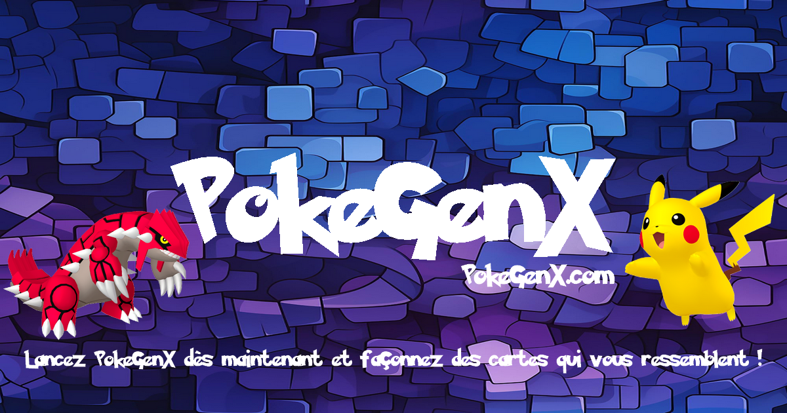

Partage et licence
- Le code est 100 % JavaScript, sans dépendances serveur.
- Libre de réutilisation et de modification. Mentionnez simplement la source si vous le diffusez publiquement.

PokeGenX ne produit pas de cartes originales !
- Nos créations ne sont ni officielles ni affiliées à The Pokémon Company.
- La reproduction, la distribution ou l’utilisation commerciale de cartes Pokémon est strictement interdite par les droits de propriété intellectuelle détenus par The Pokémon Company.
- Les cartes PokeGenX sont destinés à un usage personnel, éducatif ou artistique uniquement.

Fonctionnalités clés
- Chargement dynamique des données Les listes de Pokémon et de fonds proviennent directement de fichiers JSON/TXT hébergés sur GitHub.
- Animation de flip Cliquez sur la carte pour la faire basculer recto/verso grâce à une interpolation « easeInOutCubic ».
- Effet de paillettes (sparkles) Activez ou désactivez un effet visuel festif via une simple checkbox.
- Personnalisation du filigrane Saisissez jusqu’à 8 caractères pour le texte tourné affiché au verso.
Export
- PNG écran : téléchargement direct de la carte au format PNG.
- PNG HD : export jusqu’à 300 DPI en recalculant un canvas off-screen.

  [pokegenx.com](https://pokegenx.com/)
  [api.pokegenx.com](https://api.pokegenx.com/)
